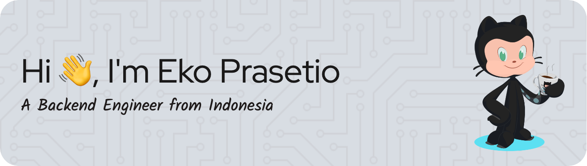

- 🔧 I specialize in **Golang** , **Ruby On Rails**, **PHP**, and frameworks like **Gin** **Echo** **Laravel** and **Rails**.
- 🔧 I Knowing in **ReactJS**  **VueJS**.
- 🌱 I'm currently exploring advanced system architecture and performance optimization.
- 🧠 Ask me about **Backend Systems**, **APIs**, and **Cloud Integrations**.
- 📫 How to reach me: **xprasetio@gmail.com**

---

### Connect with me:

---

### Languages and Tools:

---

### Play With Me
<picture>
  <source media="(prefers-color-scheme: dark)" srcset="https://raw.githubusercontent.com/xprasetio/xprasetio/output/pacman-contribution-graph-dark.svg">
  <source media="(prefers-color-scheme: light)" srcset="https://raw.githubusercontent.com/xprasetio/xprasetio/output/pacman-contribution-graph.svg">
  
</picture>

###
